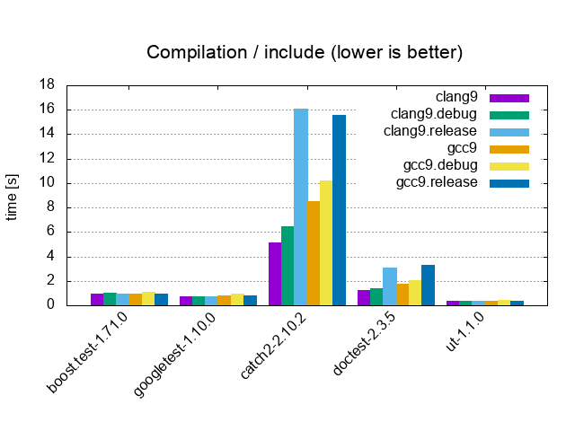
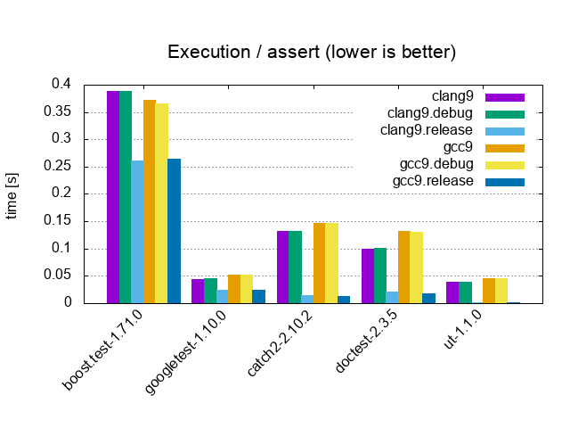
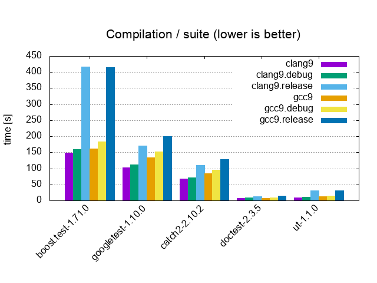
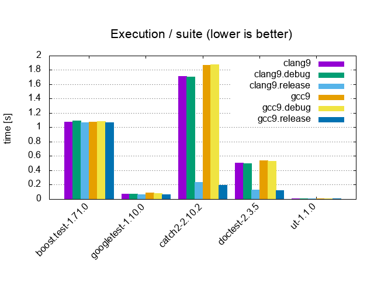
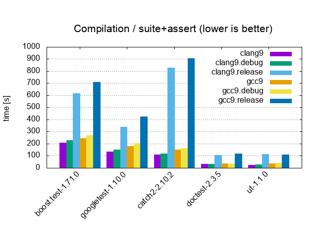

# Unit Testing Frameworks - Benchmarks

* **Frameworks**

  * [googletest-1.10.0](https://github.com/google/googletest/releases/tag/release-1.10.0)
  * [catch-2.10.2](https://github.com/catchorg/Catch2/releases/download/v2.10.2/catch.hpp)
    * `CATCH_CONFIG_FAST_COMPILE`
  * [doctest-2.3.5](https://github.com/onqtam/doctest/blob/master/doctest/doctest.h)
    * `DOCTEST_CONFIG_SUPER_FAST_ASSERTS`
  * [μt-1.1.0](https://github.com/boost-experimental/ut/blob/master/include/boost/ut.hpp)

* **Benchmarks**

  

  <table>
    <tr>
      <td colspan="2" align="center">
      <a href="benchmarks"><b>Include</b></a> / <i>0 tests, 0 asserts, 1 cpp file</i>
      </td>
    </tr>
    <tr>
      <td></td>
      <td></td>
    </tr>
  </table>
  

  <table>
    <tr>
      <td colspan="2" align="center">
      <a href="benchmarks"><b>Assert</b></a> / <i>1 test, 1'000'000 asserts, 1 cpp file</i>
      </td>
    </tr>
    <tr>
      <td></td>
      <td></td>
    </tr>
  </table>

  <table>
    <tr>
      <td colspan="2" align="center">
      <a href="benchmarks"><b>Test</b></a> / <i>1'000 tests, 0 asserts, 1 cpp file</i>
      </td>
    </tr>
    <tr>
      <td></td>
      <td></td>
    </tr>
  </table>

  <table>
    <tr>
      <td colspan="2" align="center">
      <a href="benchmarks"><b>Suite</b></a> / <i>10'000 tests, 0 asserts, 100 cpp files</i>
      </td>
    </tr>
    <tr>
      <td></td>
      <td></td>
    </tr>
  </table>

  <table>
    <tr>
      <td colspan="2" align="center">
      <a href="benchmarks"><b>Suite+Assert</b></a> / <i>10'000 tests, 20'200 asserts, 100 cpp files</i>
      </td>
    </tr>
    <tr>
      <td></td>
      <td></td>
    </tr>
  </table>
