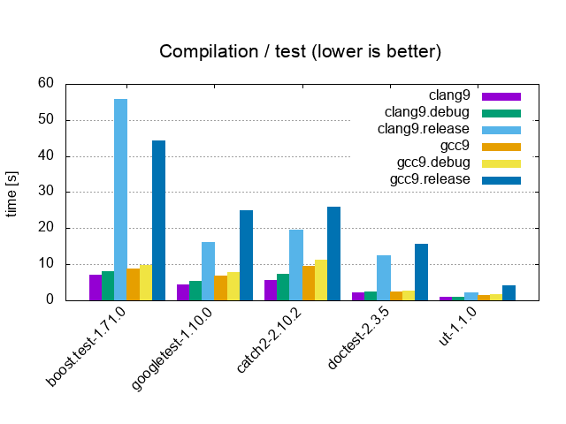
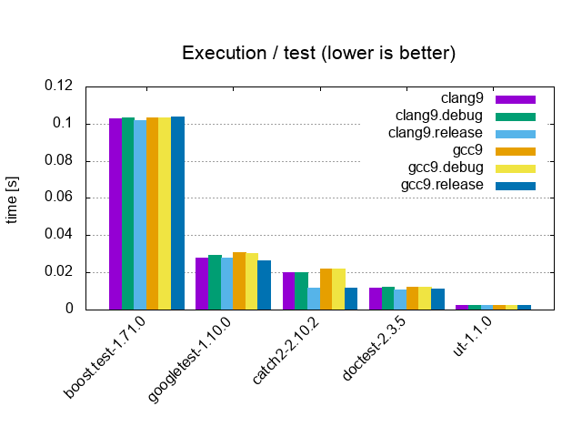
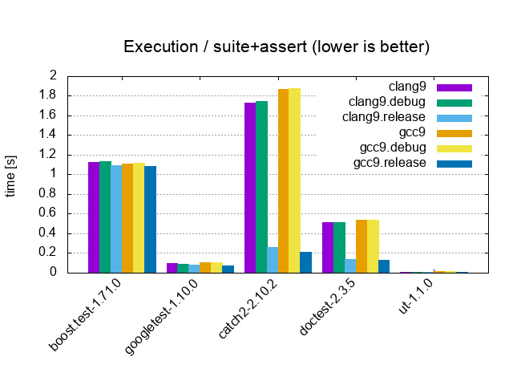

# Benchmarks - Unit Testing Frameworks

| Framework     | [GoogleTest](https://github.com/google/googletest) | [Catch](https://github.com/catchorg/Catch2) | [Doctest](https://github.com/onqtam/doctest) | [μt](https://github.com/boost-experimental/ut) |
|-|-|-|-|-|
| Version       | [1.10.0](https://github.com/google/googletest/releases/tag/release-1.10.0) | [2.10.2](https://github.com/catchorg/Catch2/releases/download/v2.10.2/catch.hpp) | [2.3.5](https://github.com/onqtam/doctest/blob/master/doctest/doctest.h) | [1.1.0](https://github.com/boost-experimental/ut/blob/master/include/boost/ut.hpp) |
| Standard      | C++11 | C++11 | C++11 | C++20 |
| License       | BSD-3 | Boost 1.0 | MIT | Boost 1.0 |
| Linkage       | library | single header | single header | single header/module |
| Test configuration | `static library` | `CATCH_CONFIG_FAST_COMPILE` | `DOCTEST_CONFIG_SUPER_FAST_ASSERTS` | |

<table>
  <tr>
    <td colspan="2" align="center">
    <a href="benchmarks"><b>Include</b></a> / <i>0 tests, 0 asserts, 1 cpp file</i>
    </td>
  </tr>
  <tr>
    <td colspan="2" align="center"></td>
    <td></td>
  </tr>

  <tr>
    <td colspan="2" align="center">
    <a href="benchmarks"><b>Assert</b></a> / <i>1 test, 1'000'000 asserts, 1 cpp file</i>
    </td>
  </tr>
  <tr>
    <td></td>
    <td></td>
  </tr>

  <tr>
    <td colspan="2" align="center">
    <a href="benchmarks"><b>Test</b></a> / <i>1'000 tests, 0 asserts, 1 cpp file</i>
    </td>
  </tr>
  <tr>
    <td></td>
    <td></td>
  </tr>

  <tr>
    <td colspan="2" align="center">
    <a href="benchmarks"><b>Suite</b></a> / <i>10'000 tests, 0 asserts, 100 cpp files</i>
    </td>
  </tr>
  <tr>
    <td></td>
    <td></td>
  </tr>

  <tr>
    <td colspan="2" align="center">
    <a href="benchmarks"><b>Suite+Assert</b></a> / <i>10'000 tests, 20'200 asserts, 100 cpp files</i>
    </td>
  </tr>
  <tr>
    <td></td>
    <td></td>
  </tr>
</table>
